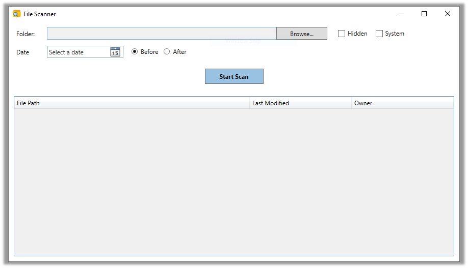
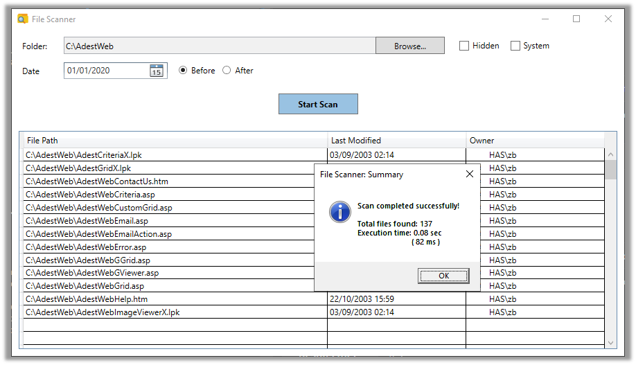
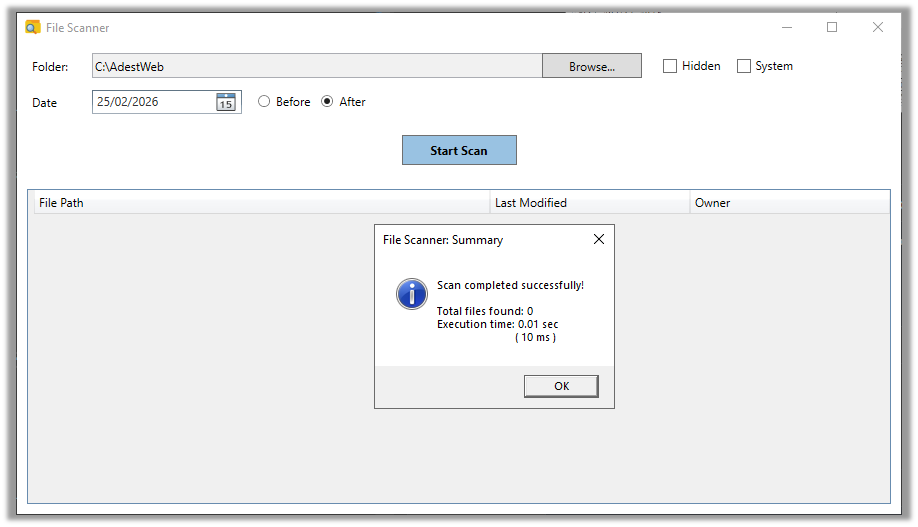
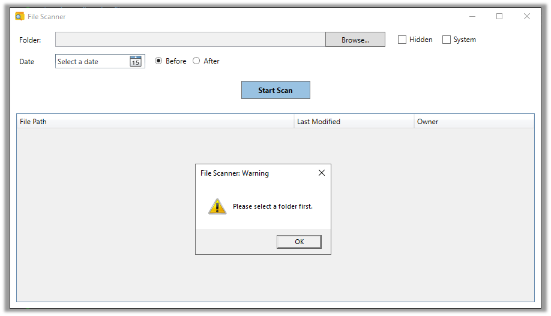
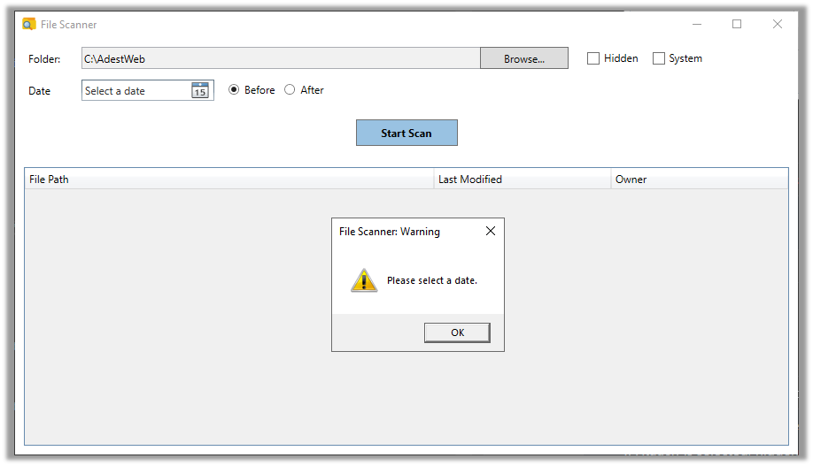
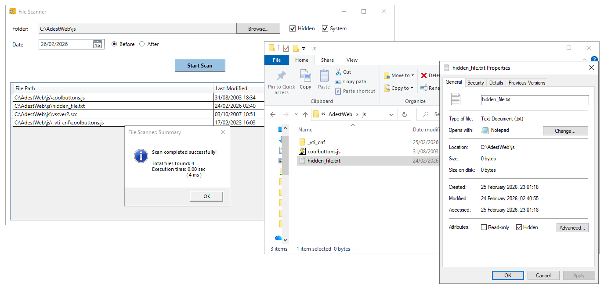

# File Scanner App

## Overview 
This is simple WPF desktop application built in .NET 8.

This project started as a personal challenge, I have been working in web development, but I had never built a desktop app before. I wanted to see whether I could design and deliver Windows application from scratch - mainly as a learning experience and simply for fun.

  

## What application does
* Scans selected folders and generate a report with detailed file information
* Allows user to select a target folder and date for scan purpose
* Allows to apply filters to search criteria: 
	* to include hidden files
	* to include protected system files
	* to apply date 'After' the selected date
	* to apply date 'Before' the selected date 
* Scans all files, including subdirectories and produces a text report containing
	* File path	
	* Last modified date
	* File owner
* Provides functionality to stop the scanning process
* Allows to exports results to CSV file
* Displays scan progress
* Measures and shows number of found files meeting the search criteria and 
* Measures and provides the total execution time 

	## Important:
	### Hidden and System files:
	> By default, hidden and system files are not included in the scan. 
	> To include them, you must enable the corresponding checkboxes.

	If a file is both <em>Hidden</em> and <em>System</em>, it won't show up if you only enable one of those options. 
    Think of it this way: if any part of the file is still "restricted" by an unchecked box, it stays hidden. 
    To make sure you see everything, it's best to check both boxes.

	### Date Filter behavior:
	> The **Before** and **After** filters do not include the selected date.
		
	If you want to include a specific day in a **Before** search, select the next day and choose **Before**
	The same logic applies to **After** - the selected date is always excluded ! 		

## Use Cases
### 1. Basic folder scan

<table>
	<tr>
		<th>Scenario</th>
		<td> User selects a folder, chooses a date and select either **Before** or **After**, then clicks <em>Start Stan</em></td>
	</tr>
	<tr>
		<th>Expected result</th>
		<td>Application scans the selected folder and subfolders and displays all files that match the choosen date condition</td>
	</tr>
	<tr>
		<th>Results met?</th>
		<td>Yes</td>
	</tr>
</table>

Evidence:

  

### 2. No matching files

<table>
	<tr>
		<th>Scenario</th>
		<td>User runs a scan but no files match the selected criteria</td>
	</tr>
	<tr>
		<th>Expected result</th>
		<td>The results list remians empty.
		A summary windows is displayed, showing:
		<ul><li>Tital files found: 0</li><li>Execution time: X </li></ul>
		</td>
	</tr>
	<tr>
		<th>Results met?</th>
		<td>Yes</td>
	</tr>
</table>

Evidence:

  

### 3. No folder selected

<table>
	<tr>
		<th>Scenario</th>
		<td>User clicks <em>Start Scan</em> without selecting a folder</td>
	</tr>
	<tr>
		<th>Expected result</th>
		<td>The scan does not start. User is informed that a folder must be selected</td>
	</tr>
	<tr>
		<th>Results met?</th>
		<td>Yes</td>
	</tr>
</table>

Evidence:

  

### 4. No date selected 

<table>
	<tr>
		<th>Scenario</th>
		<td>User selects a folder but does not choose a date and attempts to start the scan</td>
	</tr>
	<tr>
		<th>Expected result</th>
		<td>The scan does not start. User must select a valid date before proceeding. An appriorate message is displayed</td>
	</tr>
	<tr>
		<th>Results met?</th>
		<td>Yes</td>
	</tr>
</table>

Evidence:

  

### 5. Hidden and System files

<table>
	<tr>
		<th>Scenario</th>
		<td>User runs a scan with hidden and/or system file options enabled</td>
	</tr>
	<tr>
		<th>Expected result</th>
		<td>
			<ul>
				<li>By default, hidden and system files are excluded</li>
				<li>If <em>Hidden</em> is selected, hidden files are included</li>
				<li>If <em>System</em> is selected, system files are included</li>
				<li>If the target file has both attributes, you must select both options <em>Hidden</em> and <em>System</em> to include it in the scan.
				For security reasons, unselected attributes act as an explicit exclusion and take precedence over selected ones.</li>
				<li>Summary windows should display</li>
			</ul>
		</td>
	</tr>
	<tr>
		<th>Results met?</th>
		<td>Yes</td>
	</tr>
</table>

Evidence:

  

 
## Technology and tools used
* .NET
* WPF
* C#
* Visual Studio
* Git

## Lessons learned
* Desktop UI layout requires more planning than expected
* Threading matters more than in web development
* File system access brings edge cases (hidden files, system files, permissions)
* It proves that stepping outside your usual stack is uncomfortable - but doable