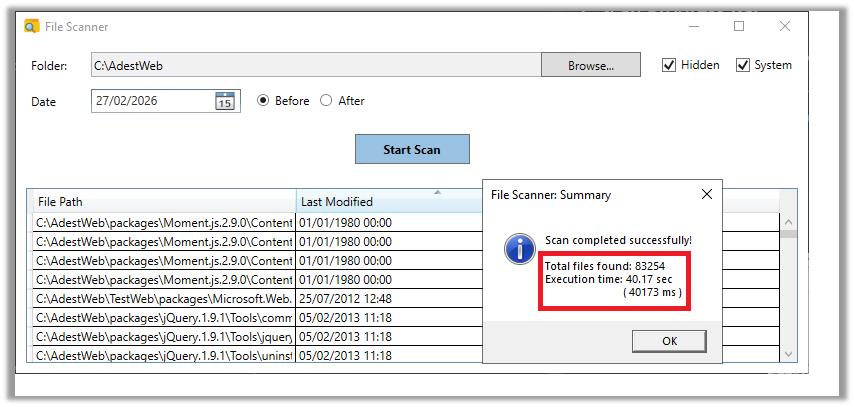
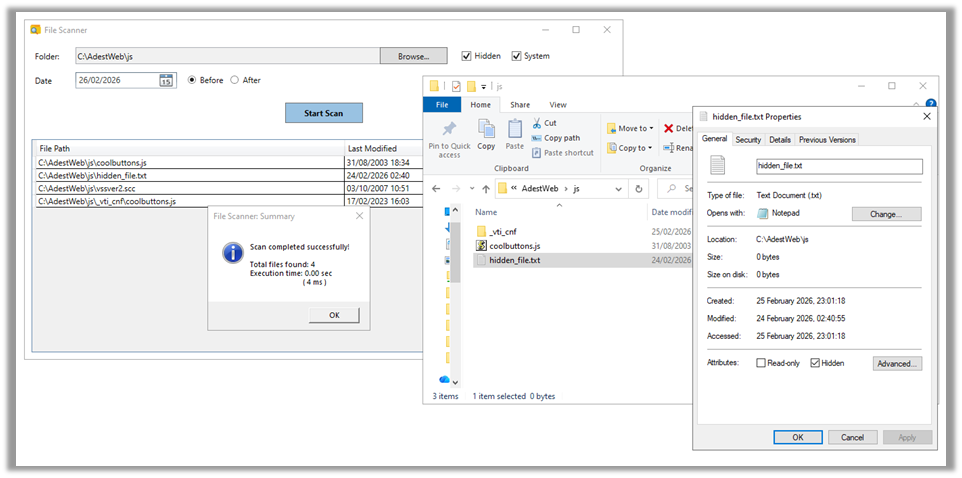
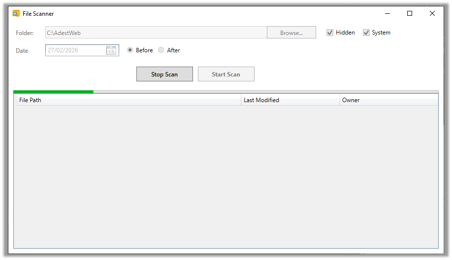
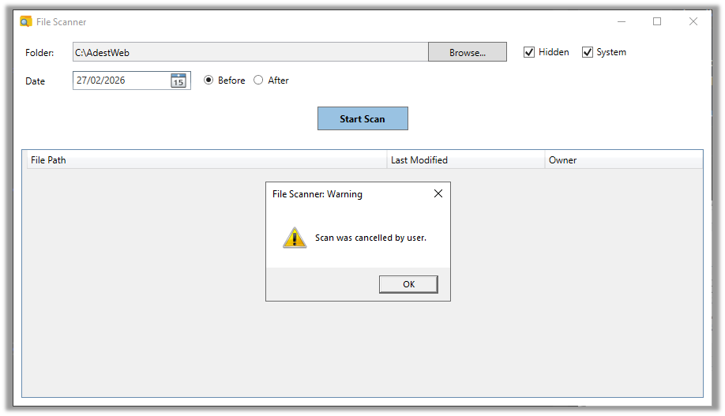
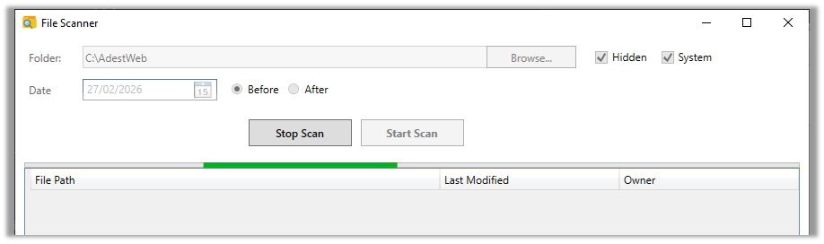
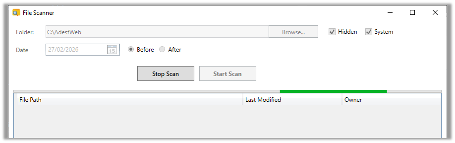

# File Scanner App

## Overview 
This is simple WPF desktop application built in .NET 8.

This project started as a personal challenge, I have been working in web development, but I had never built a desktop app before. I wanted to see whether I could design and deliver Windows application from scratch - mainly as a learning experience and simply for fun.

  

## What application does
* Scans selected folders and generate a report with detailed file information
* Allows user to select a target folder and date for scan purpose
* Allows to apply filters to search criteria: 
	* to include hidden files
	* to include protected system files
	* to apply date 'After' the selected date
	* to apply date 'Before' the selected date 
* Scans all files, including subdirectories and produces a text report containing
	* File path	
	* Last modified date
	* File owner
* Provides functionality to stop the scanning process
* Allows to exports results to CSV file
* Displays scan progress
* Measures and shows number of found files meeting the search criteria and 
* Measures and provides the total execution time 

	## Important:
	### Hidden and System files:
	> By default, hidden and system files are not included in the scan. 
	> To include them, you must enable the corresponding checkboxes.

	If a file is both <em>Hidden</em> and <em>System</em>, it won't show up if you only enable one of those options. 
    Think of it this way: if any part of the file is still "restricted" by an unchecked box, it stays hidden. 
    To make sure you see everything, it's best to check both boxes.

	### Date Filter behaviour:
	> The **Before** and **After** filters do not include the selected date.
		
	If you want to include a specific day in a **Before** search, select the next day and choose **Before**
	The same logic applies to **After** - the selected date is always excluded ! 

## Performance & Responsiveness

This application was designed with scanning speed and UI responsiveness in mind.

The scanning process runs in a way that does not block the user interface. 

Even during large scans, the UI remains responsive and the user can cancel the scan if needed.

### Performance Test

A performance test was conducted on a folder of approximately <strong>4GB</strong>, including:
<ul>
	<li>
		regular files
	</li>
		<li>
		hidden files
	</li>
		<li>
		system files
	</li>
</ul>

The full scan completed in approximately <strong>40 seconds</strong> :rocket: 

  

This test included scanning subfolders and applying file attribute filters.

## Use Cases
### 1. Basic folder scan

<table>
	<tr>
		<th>Scenario</th>
		<td> User selects a folder, chooses a date and select either **Before** or **After**, then clicks <em>Start Stan</em></td>
	</tr>
	<tr>
		<th>Expected result</th>
		<td>Application scans the selected folder and subfolders and displays all files that match the chosen date condition</td>
	</tr>
	<tr>
		<th>Results met?</th>
		<td>Yes</td>
	</tr>
</table>

Evidence:

  

### 2. No matching files

<table>
	<tr>
		<th>Scenario</th>
		<td>User runs a scan but no files match the selected criteria</td>
	</tr>
	<tr>
		<th>Expected result</th>
		<td>The results list remains empty.
		A summary windows is displayed, showing:
		<ul><li>Total files found: 0</li><li>Execution time: X </li></ul>
		</td>
	</tr>
	<tr>
		<th>Results met?</th>
		<td>Yes</td>
	</tr>
</table>

Evidence:

  

### 3. No folder selected

<table>
	<tr>
		<th>Scenario</th>
		<td>User clicks <em>Start Scan</em> without selecting a folder</td>
	</tr>
	<tr>
		<th>Expected result</th>
		<td>The scan does not start. User is informed that a folder must be selected</td>
	</tr>
	<tr>
		<th>Results met?</th>
		<td>Yes</td>
	</tr>
</table>

Evidence:

  

### 4. No date selected 

<table>
	<tr>
		<th>Scenario</th>
		<td>User selects a folder but does not choose a date and attempts to start the scan</td>
	</tr>
	<tr>
		<th>Expected result</th>
		<td>The scan does not start. User must select a valid date before proceeding. An appropriate message is displayed</td>
	</tr>
	<tr>
		<th>Results met?</th>
		<td>Yes</td>
	</tr>
</table>

Evidence:

  

### 5. Hidden and System files

<table>
	<tr>
		<th>Scenario</th>
		<td>User runs a scan with hidden and/or system file options enabled</td>
	</tr>
	<tr>
		<th>Expected result</th>
		<td>
			<ul>
				<li>By default, hidden and system files are excluded</li>
				<li>If <em>Hidden</em> is selected, hidden files are included</li>
				<li>If <em>System</em> is selected, system files are included</li>
				<li>If the target file has both attributes, you must select both options <em>Hidden</em> and <em>System</em> to include it in the scan.
				For security reasons, unselected attributes act as an explicit exclusion and take precedence over selected ones.</li>
				<li>Summary windows should display</li>
			</ul>
		</td>
	</tr>
	<tr>
		<th>Results met?</th>
		<td>Yes</td>
	</tr>
</table>

Evidence:

  

### 6. Stop Scan

<table>
	<tr>
		<th>Scenario</th>
		<td>User starts a scan and decides to stop it before completion by clicking the <em>Stop Scan</em> button</td>
	</tr>
	<tr>
		<th>Expected result</th>
		<td>
			The scanning process is immediately stopped.
			A popup window appears informing the user that: 
			<ul>
				<li>
					The scan was cancelled by the user
				</li>
			</ul>
			No further files are processed after cancellation
		</td>
	</tr>
	<tr>
		<th>Results met?</th>
		<td>Yes</td>
	</tr>
</table>

Evidence:

  

  

### 7. Scan Progress Bar

<table>
	<tr>
		<th>Scenario</th>
		<td>User starts a scan of a folder containing multiple files and subfolders</td>
	</tr>
	<tr>
		<th>Expected result</th>
		<td>
			While the scan is running, a progress bar is displayed to indicate that the process is in progress.
			The progress bar updates during the scan and disappears when the scan finished or was cancelled. 
		</td>
	</tr>
	<tr>
		<th>Results met?</th>
		<td>Yes</td>
	</tr>
</table>

Evidence:

  

  

 
## Technology and tools used
* .NET
* WPF
* C#
* Visual Studio
* Git

## Lessons learned
* Desktop UI layout requires more planning than expected
* Threading matters more than in web development
* File system access brings edge cases (hidden files, system files, permissions)
* It proves that stepping outside your usual stack is uncomfortable - but doable

## References:

### 1. WPF Foundations & Environment

Everything you need to get started with the framework and project setup.

* [WPF Desktop Documentation - Home (MS Docs)](https://learn.microsoft.com/en-us/dotnet/desktop/wpf/)
* [Create your first WPF App in Visual Studio (MS Docs)](https://learn.microsoft.com/en-us/dotnet/desktop/wpf/get-started/create-app-visual-studio)
* [WPF-Tutorial.com - Comprehensive Guide](https://wpf-tutorial.com/)
* [Windows Presentation Foundation (WPF) Overview (Luxford)](https://www.luxford.com/windows-presentatiion-foundation-wpf)
* [Video: WPF and C# Tutorials Playlist (YouTube)](https://www.youtube.com/watch?v=t9ivUosw_iI&list=PLih2KERbY1HHOOJ2C6FOrVXIwg4AZ-hk1)

### 2. UI: Controls, Styles, and Templates

Building the visual interface and managing the look and feel of your application.

* [WPF Controls Overview (MS Docs)](https://learn.microsoft.com/en-us/dotnet/desktop/wpf/controls/)
* [Styles and Templates Overview (MS Docs)](https://learn.microsoft.com/en-us/dotnet/desktop/wpf/controls/styles-templates-overview)
* [How to Create and Apply a Style (MS Docs)](https://learn.microsoft.com/en-us/dotnet/desktop/wpf/controls/how-to-create-apply-style)
* [Working with Templates in WPF (Dev.to)](https://dev.to/deogadkarravina/wpf-working-with-templates-1jkb)
* [Styling WPF Applications is Easy (Medium)](https://medium.com/@JoshuaTheMiller/styling-wpf-applications-is-easy-0-af853ad07b0d)
* [Creating a Custom WPF Button Template (Mark Heath)](https://markheath.net/post/creating-custom-wpf-button-template-in)
* [Understanding WPF ItemsControl (Dev.to)](https://dev.to/brandonmweaver/wpf-itemscontrol-17bp)
* [Archive: Troubleshooting Resource Dictionaries (MSDN)](https://learn.microsoft.com/en-us/archive/msdn-technet-forums/1ade1ae1-c5b9-4a8a-98ce-7ad50fb15ee5)

### 3. Data Binding & MVVM

The core of WPF. Connecting your C# logic to your XAML views.

* [WPF Data Binding Documentation (MS Docs)](https://learn.microsoft.com/en-us/dotnet/desktop/wpf/data/)
* [Using the DataContext in WPF (WPF-Tutorial)](https://wpf-tutorial.com/tg/36/data-binding/using-the-datacontext/)
* [How to Implement Property Change Notification (MS Docs)](https://learn.microsoft.com/en-us/dotnet/desktop/wpf/data/how-to-implement-property-change-notification)
* [Deep Dive into INotifyPropertyChanged (PostSharp)](https://blog.postsharp.net/inotifypropertychanged)
* [WPF Data Binding and INotifyPropertyChanged (WellsB)](https://wellsb.com/csharp/learn/wpf-data-binding-csharp-inotifypropertychanged)
* [Explaining INotifyPropertyChanged in MVVM (C# Corner)](https://www.c-sharpcorner.com/article/explain-inotifypropertychanged-in-wpf-mvvm/)
* [Binding property with Parent ViewModel (StackOverflow)](https://stackoverflow.com/questions/18717241/binding-property-with-parent-viewmodel)
* [What is the RelativeSource Property? (Syncfusion)](https://www.syncfusion.com/faq/wpf/databinding/what-is-the-use-of-the-relativesource-property)
* [RelativeSource Class API (MS Docs)](https://learn.microsoft.com/en-us/dotnet/api/system.windows.data.binding.relativesource?view=windowsdesktop-10.0&viewFallbackFrom=net-8.0)

### 4. Data Formatting in UI

Displaying numbers, sizes, and strings correctly within your views.

* [BindingBase.StringFormat Property (MS Docs)](https://learn.microsoft.com/en-us/dotnet/api/system.windows.data.bindingbase.stringformat?view=windowsdesktop-10.0&viewFallbackFrom=net-8.0)
* [WPF StringFormat in XAML with Attributes (ElegantCode)](https://elegantcode.com/2009/04/07/wpf-stringformat-in-xaml-with-the-stringformat-attribute/)
* [XAML: Using String Format (Github.io)](https://ukimiawz.github.io/xaml/2012/06/12/xaml-using-string-format/)
* [WPF DataGrid Formatting - Part 1 (Wordpress)](https://csharphardcoreprogramming.wordpress.com/2014/04/29/wpf-datagrid-formatting-part-1/)
* [Using ByteSize to Represent Byte Sizes (C# Corner)](https://www.c-sharpcorner.com/article/using-bytesize-to-represent-byte-size/)
* [ByteSize C# Guide (IronPDF)](https://ironpdf.com/blog/net-help/bytesize-csharp-guide/)

### 5. Asynchronous Programming & Performance

Handling long-running tasks without freezing the UI.

* [Task-based Asynchronous Programming (MS Docs)](https://learn.microsoft.com/en-us/dotnet/standard/parallel-programming/task-based-asynchronous-programming)
* [Task.Run vs Await: What Every Developer Should Know (Dev.to)](https://dev.to/stevsharp/taskrun-vs-await-what-every-c-developer-should-know-1mmi)
* [Implementing CPU-Bound Operations in .NET (Syncfusion)](https://www.syncfusion.com/blogs/post/implementing-cpu-bound-operations-in-an-asp-net-core-application)
* [Mastering CancellationToken in .NET 8 (Medium)](https://medium.com/@michaelmaurice410/mastering-cancellationtoken-in-net-8-a-must-have-skill-for-modern-developers-f3594f151054)
* [CancellationTokenSource Class (MS Docs)](https://learn.microsoft.com/en-us/dotnet/api/system.threading.cancellationtokensource?view=net-8.0)
* [Archive: WPF Threading and UI Updates (MSDN)](https://learn.microsoft.com/en-us/archive/msdn-technet-forums/6c933593-373a-4fa1-a50b-2876e132a99c)
* [Stopwatch Class - Performance Measurement (MS Docs)](https://learn.microsoft.com/en-us/dotnet/api/system.diagnostics.stopwatch?view=net-8.0)

### 6. C# Logic, Collections, and LINQ

Processing data "under the hood."

* [Built-in Collection Types in C# (MS Docs)](https://learn.microsoft.com/en-us/dotnet/csharp/language-reference/builtin-types/collections)
* [IEnumerable Interface (MS Docs)](https://learn.microsoft.com/en-us/dotnet/api/system.collections.ienumerable?view=net-8.0)
* [Introduction to LINQ in C# (Medium)](https://medium.com/@ravipatel.it/introduction-to-linq-in-c-26bf70607d14)
* [Grouping Data with LINQ (MS Docs)](https://learn.microsoft.com/en-us/dotnet/csharp/linq/standard-query-operators/grouping-data)
* [C# LINQ Any() Explained (Dev.to)](https://dev.to/rafaeljcamara/c-linq-any-explained-3d58)
* [Null-coalescing operators ?? and ??= (MS Docs)](https://learn.microsoft.com/en-us/dotnet/csharp/language-reference/operators/null-coalescing-operator)
* [EnumerateDirectories Method (MS Docs)](https://learn.microsoft.com/en-us/dotnet/api/system.io.directory.enumeratedirectories?view=net-8.0)
* [EnumerateFiles Method (MS Docs)](https://learn.microsoft.com/en-us/dotnet/api/system.io.directory.enumeratefiles?view=net-8.0)
